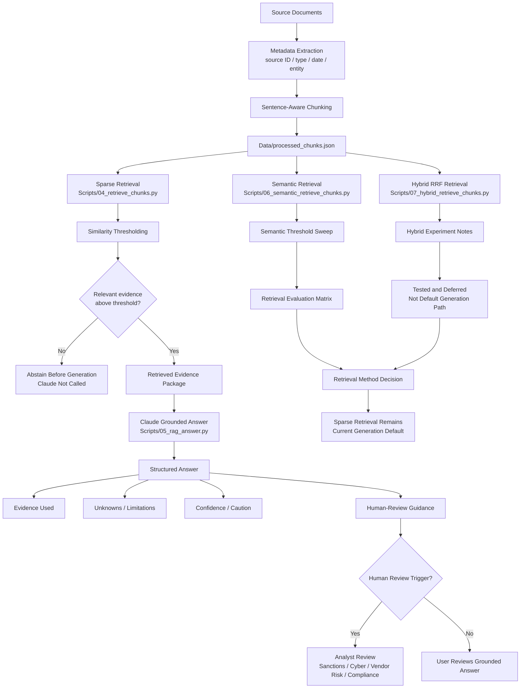

# Architecture Diagram

## Purpose

This document explains the current architecture of the Compliance Risk RAG Assistant.

The goal is to show how evidence moves through the system, which retrieval path currently feeds Claude, where abstention occurs, and where semantic and hybrid retrieval fit as evaluated alternatives.

This diagram reflects the current prototype. It does not show production components that have not been implemented.

## Current Architecture



## Architecture Lanes

### 1. Source Processing Lane

```text
Source documents
→ metadata extraction
→ sentence-aware chunking
→ Data/processed_chunks.json
```

The source processing lane prepares evidence for retrieval.

The system uses synthetic third-party risk source documents, including:

- corporate registry evidence
- sanctions screening evidence
- cybersecurity monitoring evidence
- vendor questionnaire evidence

Metadata extraction reads source-level fields from each synthetic document and preserves them on every processed chunk.

This includes:

- source ID
- source name
- source type
- source date
- entity
- chunk ID

This matters because the assistant should not treat all evidence the same. A vendor questionnaire, sanctions screening report, corporate registry extract, and cybersecurity monitoring report have different authority, freshness, and decision value.

Sentence-aware chunking then breaks source documents into chunks while preserving complete claims, qualifiers, and source context.

### 2. Current Generation Lane

```text
Data/processed_chunks.json
→ sparse retrieval
→ similarity thresholding
→ retrieved evidence
→ Claude grounded answer
→ answer / abstention / human review
```

Sparse retrieval is the current generation path.

The RAG answer script uses sparse retrieval to select evidence before calling Claude. If no relevant evidence is retrieved above the threshold, the system abstains before generation and Claude is not called.

This is intentional because sparse retrieval performed more safely on the evaluated abstention and conflict cases.

### 3. Semantic Evaluation Lane

```text
Data/processed_chunks.json
→ semantic retrieval
→ semantic threshold sweep
→ retrieval evaluation matrix
```

Semantic retrieval is implemented as an evaluated alternative.

It improved meaning-based matching for several direct evidence questions, including ownership, sanctions ambiguity, cyber risk, and missing sanctions identifiers.

However, semantic retrieval also returned related-but-non-answering evidence for the unsupported bribery/corruption question. The semantic threshold sweep showed that higher thresholds improved abstention but could filter out evidence needed for conflict detection.

For that reason, semantic retrieval is not the current default generation path.

### 4. Hybrid Evaluation Lane

```text
Data/processed_chunks.json
→ hybrid RRF retrieval
→ hybrid experiment notes
→ tested and deferred
```

Hybrid retrieval was tested using Reciprocal Rank Fusion.

RRF was used because sparse retrieval scores and semantic embedding scores are not directly comparable. RRF combines ranked outputs instead of averaging raw scores.

Hybrid retrieval improved the patching conflict case by surfacing both the vendor questionnaire and the later cybersecurity monitoring report.

However, hybrid retrieval still returned related-but-non-answering chunks for the unsupported bribery/corruption question. Because it did not solve evidence sufficiency, it is documented as an evaluated alternative and deferred as the default generation path.

## Retrieval Method Decision

The current generation path remains:

```text
Sparse retrieval → thresholding → Claude grounded answer
```

Semantic retrieval and hybrid retrieval are implemented and evaluated, but they do not feed Claude by default.

The decision is:

```text
Sparse retrieval = current generation default
Semantic retrieval = evaluated alternative
Hybrid retrieval = tested with RRF and deferred
```

This decision is based on the evaluation results:

- Sparse retrieval was safer on unsupported allegation handling.
- Semantic retrieval improved meaning-based matching but introduced related-but-non-answering false positives.
- Hybrid retrieval improved conflict coverage but did not solve evidence sufficiency.

## Abstention Point

Abstention happens before generation.

If sparse retrieval returns no relevant evidence above threshold, the system does not call Claude. This prevents the model from generating an answer from weak or irrelevant context.

This is an important product control because unsupported allegations should not be answered from adjacent or non-answering evidence.

## Human Review Point

Human review enters after evidence retrieval and answer generation when the system identifies ambiguity, conflict, unsupported allegations, stale data, low confidence, or high-consequence decisions.

Examples include:

- possible sanctions name match with missing identifiers
- vendor self-report without supporting evidence
- cyber monitoring evidence that conflicts with a vendor questionnaire
- unsupported bribery or corruption allegation
- stale source data
- low retrieval confidence
- onboarding, renewal, escalation, or compliance-impacting decisions

The system supports analyst judgment. It does not make final compliance or vendor risk decisions.

## What Is Not Shown

This architecture intentionally does not show:

- user interface
- production deployment
- authentication
- multi-user access
- production vector database
- LangChain
- agents
- monitoring or observability
- real customer or vendor data
- automated citation verification
- automated compliance decisioning
- analyst workflow automation

These are not shown because they are not implemented in the current prototype.

## Product Lesson

The architecture shows that a source-grounded RAG prototype is not only a model call.

The product needs:

- source preparation
- metadata preservation
- retrieval method selection
- retrieval evaluation
- threshold-based abstention
- conflict handling
- human-review rules
- clear scope boundaries

The most important architectural decision is that the system separates the current generation path from evaluated retrieval experiments.

## Product Explanation

I designed the architecture to separate the current generation path from evaluated retrieval alternatives.

The current system uses sparse retrieval as the default path into Claude because it performed more safely on unsupported allegation and conflict cases. Semantic retrieval and hybrid retrieval were both implemented and evaluated, but they are not the default generation path.

Semantic retrieval improved meaning-based matching but introduced related-but-non-answering evidence. Hybrid retrieval improved conflict coverage using Reciprocal Rank Fusion, but it still failed the unsupported bribery/corruption test. Because of that, sparse remains the current generation default while semantic and hybrid retrieval are documented as evaluated alternatives.

The main product lesson is that retrieval architecture has to reflect evidence sufficiency, not just relevance. In risk workflows, the system must know when to answer, abstain, or route to human review.

